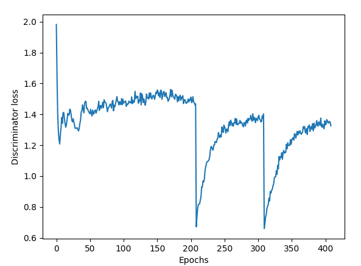
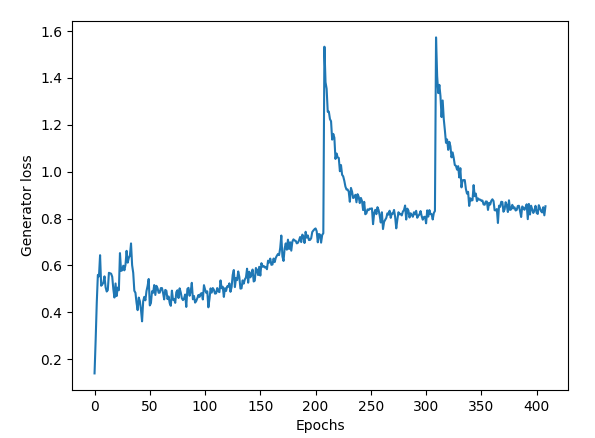
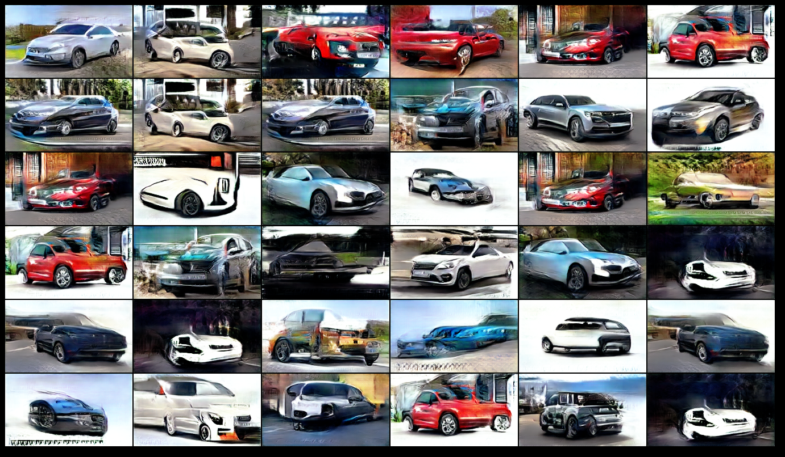
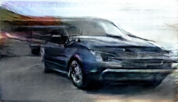

# carbrandGAN
Gan model to synthesize car images

## Data
1. Data: https://www.kaggle.com/datasets/yamaerenay/100-images-of-top-50-car-brands
2. Data Preprocessing: Manual inspection of images per folder and removing false images such as Jaguar the animal; multiple cars in a single image; car logo; skewed aspect ratio etc..
  * Original Dataset has 4579 images; Outlier images removed: 915 
  * Total Images available for Training: 3664
  * Average Image Resolution: 175 x 280 (aspect ration: 1.6)
3. Resize: 128 x 224 (aspect ratio: 1.75)

## Model Training:
1. Hinge Loss  + Gradient Pentaly + EMA smoothing + Conditional 
2. Progressive Training with Latent Dimension Modulation coupled with Differential Augmentation
3. Dual Learning Rate: lrG = 0.0001; lrD=0.0004
4. Adam Optimizer
5. Trained for 400 Epochs: 200 with latentDim: 100; 100 with latentDim: 200 and 100 with latentDim: 300

## Network
1. Fully convolutional (like DCGAN)
2. With Spectral Norm and Mish Nonlinearity

## Motivation for choice for training and network
1. Hinge Gan Loss penalizes synthesis of similar images .. helps reduce mode collapse; 
2. Gradient loss, Ema Smoothing improve training stablity
3. Conditional training allows for synthesis of cars based on input class 
4. Differential augmentation is a data augmentation technique to improve stability of gan training in presence of limited training samples.
5. Spectral Norm and Mish nonlinearity (~differential version of relu nonlinearity) further boost stability of gan training
6. Ideally want to do progressive training starting with learn high level features at lower resolution and increasing image resolution,but given the time constraints, I chose to implement latent dim version of progressive training.. progressively increasing latent dimension as training progresses to increase model complexity gradually to allow for the model to produce rich variety of images

## Potential Improvements
1. Train for a longer time (may be 300 epochs per latent dimension size or longer..which translates to about ~38000 iteration (with batch size of 32).. for total training iterations of about 160000.
2. Consider further cleaning of data to remove front facing and back facing images
3. Modify network architecture to incorporate style elements --stylegan or later iterations, possibly starting with pre-trained version of these
4. Modify network architecture to incorporate self attention-- SAGAN type network architecture
5. Consider extensions of conditional GAN by incorporating auxillary classifier loss and improved versions there of.
6. Add cosine similarity loss to further boost image variability
7. New direction could be to possibly explore stable-diffusion framework to synthesize images from text prompts using pre-trained models from huggingface

## Training:

python . <Model Folder Name> --hinge --logFreq 100 --lr 0.0001 --activation --numEpochs 400 --ema --diffAug --proTrain --latentDim 200 --activation --conditional
 
## Evaluation
 To synthesize random images
* python . <Model Folder Name> --eval --latentDim 300 --Dcheckpoint <Discriminator Checkpoint> --Gcheckpoint <Generator Checkpoint> --conditional --labelIndex -1

## Results

